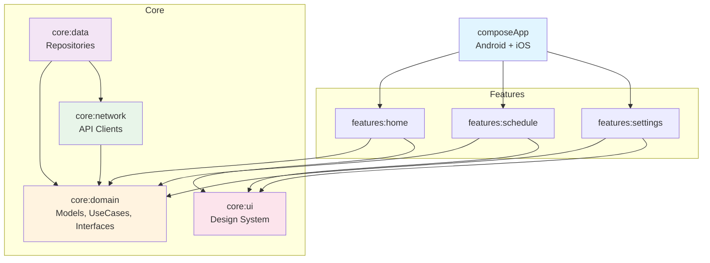
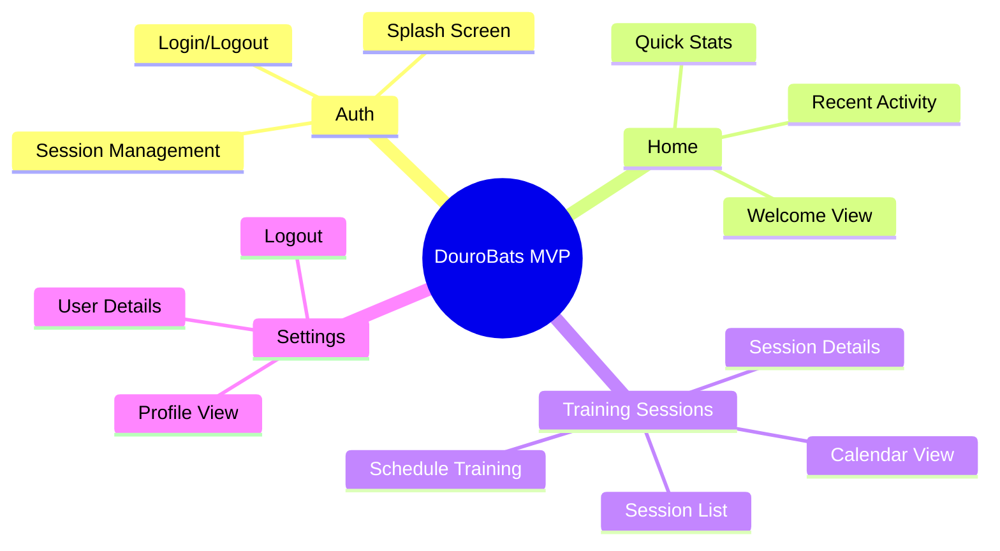

# DouroBats Architecture

## Multi-Module Structure

## Module Responsibilities

### 🎯 composeApp (Application Module)
- Android + iOS entry points
- App-level navigation
- Dependency injection setup (Koin modules)
- MainActivity (Android) / iOSApp (iOS)

### 🏗️ core:domain (Pure Kotlin)
- **Domain Models**: `TrainingSession`, `User`, `Team`
- **Use Cases**: Business logic (e.g., `GetTrainingSessionsUseCase`)
- **Repository Interfaces**: Contracts for data layer
- **No Android/iOS dependencies**

### 📦 core:data (KMP)
- **Repository Implementations**: Implements domain interfaces
- **Data Sources**: Local and Remote data sources
- **Mappers**: DTO ↔ Domain model conversion
- Future: Room/SQLDelight for local storage

### 🌐 core:network (KMP)
- **API Clients**: Ktor HTTP client
- **DTOs**: API response models
- **Endpoints**: API endpoint definitions
- Future: Authentication interceptors

### 🎨 core:ui (KMP - Compose)
- **Design System**: Material 3 theme, colors, typography
- **Shared Components**: Buttons, Cards, Loading states
- **Common Composables**: Reusable UI elements

### 🏠 features:home (KMP - Compose)
- Home screen UI
- HomeViewModel
- Home-specific composables

### 📅 features:schedule (KMP - Compose)
- Schedule/Calendar screen
- ScheduleViewModel
- Interactive calendar component

### ⚙️ features:settings (KMP - Compose)
- Settings screen
- SettingsViewModel
- Profile management

---

## MVP Feature Set

### Core Features for MVP

#### Authentication Flow
- Splash screen on app launch
- Login/Logout functionality
- Session persistence and management

#### Home Screen
- Welcome message and dashboard
- Quick stats overview
- Recent training activity

#### Training Sessions
- View all training sessions in calendar format
- Browse session list
- View detailed session information
- Schedule new training sessions

#### Settings
- View user profile and details
- Manage preferences
- Logout functionality
