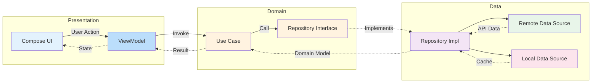

# Data Flow Architecture

## Clean Architecture Pattern

This diagram illustrates how data flows through the application layers following Clean Architecture principles.

## Layer Responsibilities

### Presentation Layer
- **Compose UI**: Displays data and captures user interactions
- **ViewModel**: Manages UI state and handles user actions

### Domain Layer
- **Use Case**: Contains business logic (e.g., GetTrainingSessionsUseCase)
- **Repository Interface**: Defines contracts for data operations
- Pure Kotlin, no platform dependencies

### Data Layer
- **Repository Implementation**: Implements domain repository interfaces
- **Remote Data Source**: Fetches data from API (Ktor)
- **Local Data Source**: Caches data locally (Room/SQLDelight)
- Handles data mapping between DTOs and domain models

## Data Flow

### Request Flow (→)
1. User interacts with UI
2. UI triggers ViewModel action
3. ViewModel invokes Use Case
4. Use Case calls Repository Interface
5. Repository Implementation fetches from Remote/Local sources

### Response Flow (-.→)
1. Data sources return DTOs
2. Repository maps DTOs to Domain Models
3. Use Case processes and returns Result
4. ViewModel updates UI State
5. UI recomposes with new state
