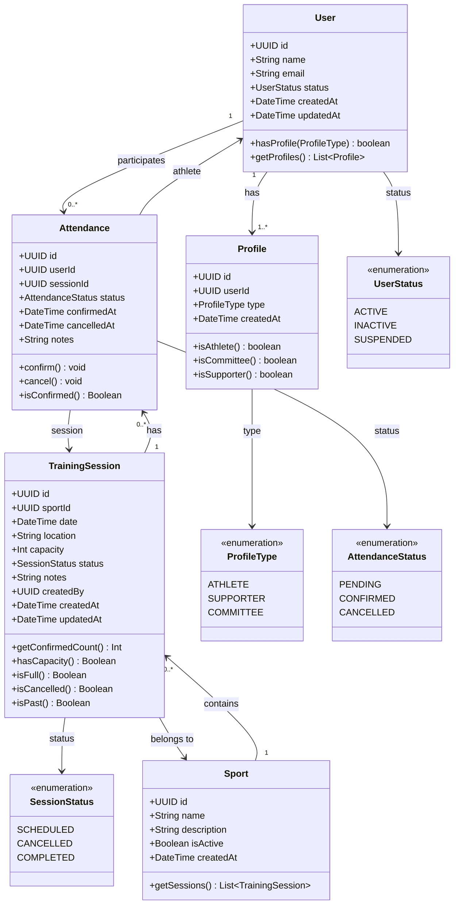

# Domain Class Diagram

This diagram shows the structure of our core domain entities, their attributes, and relationships.

## Class Diagram



## Entity Details

### User
**Identity entity** representing any person in the system.

**Key Methods:**
- `hasProfile(ProfileType)`: Check if user has specific profile type
- `getProfiles()`: Get all profiles for this user

**Invariants:**
- Email must be unique
- Must have at least one Profile
- Status cannot be null

---

### Profile
**Value object** defining user permissions and capabilities.

**Key Methods:**
- `isAthlete()`: Check if profile is Athlete type
- `isCommittee()`: Check if profile is Committee type
- `isSupporter()`: Check if profile is Supporter type

**Business Rules:**
- One user can have multiple profiles
- Profile type determines available actions

---

### Sport
**Entity** representing a sport category.

**Key Methods:**
- `getSessions()`: Get all training sessions for this sport

**Invariants:**
- Name must be unique
- isActive determines if sport is currently offered

---

### TrainingSession
**Entity** representing a scheduled training event.

**Key Methods:**
- `getConfirmedCount()`: Count confirmed attendances
- `hasCapacity()`: Check if session has available slots
- `isFull()`: Check if session is at capacity
- `isCancelled()`: Check if session is cancelled
- `isPast()`: Check if session date has passed

**Business Rules:**
- Only Committee can create/update/delete
- Cannot exceed capacity
- Cannot modify past sessions

---

### Attendance
**Entity** managing the many-to-many relationship between Users and TrainingSessions.

**Key Methods:**
- `confirm()`: Mark attendance as confirmed
- `cancel()`: Cancel confirmed attendance
- `isConfirmed()`: Check if attendance is confirmed

**Business Rules:**
- Only Athletes can have Attendance records
- Cannot confirm if session is full
- Cannot confirm for cancelled sessions
- Cannot confirm for past sessions

---

## Enumeration Values

### UserStatus
- **ACTIVE**: User can access the system
- **INACTIVE**: User account is inactive
- **SUSPENDED**: User is temporarily suspended

### ProfileType
- **ATHLETE**: Can confirm attendance for training sessions
- **SUPPORTER**: Read-only access, cannot confirm attendance
- **COMMITTEE**: Can manage training sessions and view all data

### SessionStatus
- **SCHEDULED**: Session is planned and accepting confirmations
- **CANCELLED**: Session is cancelled, no confirmations allowed
- **COMPLETED**: Session has occurred (historical record)

### AttendanceStatus
- **PENDING**: Attendance created but not yet confirmed
- **CONFIRMED**: User confirmed they will attend
- **CANCELLED**: User cancelled their attendance

---

## Relationship Cardinality

| Relationship | Cardinality | Description |
|--------------|-------------|-------------|
| User → Profile | 1 to many | A user must have at least one profile, can have multiple |
| Sport → TrainingSession | 1 to many | A sport can have zero or more training sessions |
| TrainingSession → Attendance | 1 to many | A session can have zero or more attendance records |
| User → Attendance | 1 to many | A user can attend zero or more sessions |
| TrainingSession → Sport | many to 1 | Each session belongs to exactly one sport |
| Attendance → User | many to 1 | Each attendance is for exactly one user |
| Attendance → TrainingSession | many to 1 | Each attendance is for exactly one session |

---

## Design Patterns Used

### 1. Entity Pattern
All domain objects with unique identity (User, Sport, TrainingSession, Attendance) follow the Entity pattern with:
- Unique ID (UUID)
- Equality based on ID
- Mutable state
- Lifecycle management

### 2. Value Object Pattern
Profile is a value object:
- No independent lifecycle
- Equality based on attributes
- Immutable once created

### 3. Enumeration Pattern
All status fields use enumerations for:
- Type safety
- Limited valid states
- Clear domain vocabulary

### 4. Aggregate Pattern
**User + Profiles** form an aggregate:
- User is the aggregate root
- Profiles are accessed through User
- Consistency boundary maintained

**TrainingSession + Attendance** form an aggregate:
- TrainingSession is the aggregate root
- Attendance records managed through Session
- Capacity rules enforced at aggregate boundary

---

## Object Lifecycle

### User Lifecycle
```
[New] → ACTIVE → INACTIVE
           ↓
       SUSPENDED → ACTIVE
```

### TrainingSession Lifecycle
```
[New] → SCHEDULED → COMPLETED
           ↓
       CANCELLED
```

### Attendance Lifecycle
```
[New] → PENDING → CONFIRMED → CANCELLED
                    ↑_____________|
```

---

## Next Steps

See also:
- [ER Diagram](./er-diagram.md) - Database perspective
- [Use Cases](./use-cases.md) - Interaction flows
- [Domain README](./README.md) - Complete domain overview
