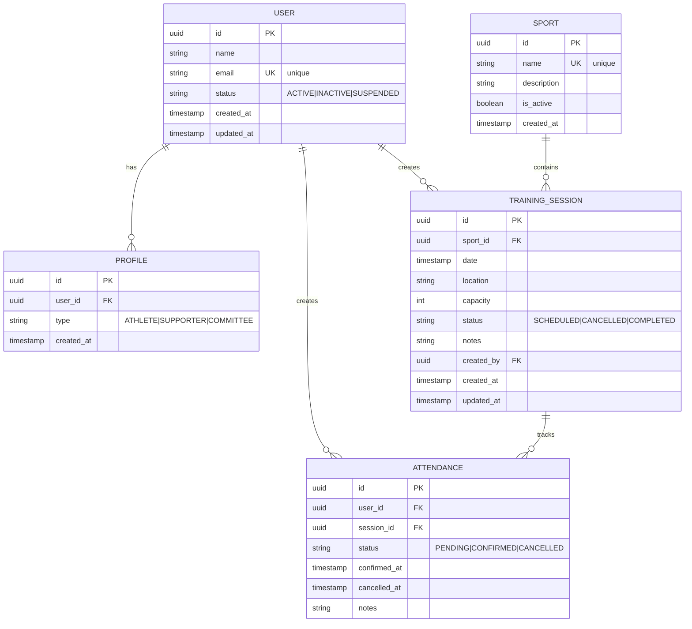

# Entity-Relationship Diagram

This diagram shows the database/persistence perspective of our domain model.

## ER Diagram



## Table Specifications

### USER Table

| Column | Type | Constraints | Description |
|--------|------|-------------|-------------|
| id | UUID | PRIMARY KEY | Unique user identifier |
| name | VARCHAR(255) | NOT NULL | User's full name |
| email | VARCHAR(255) | UNIQUE, NOT NULL | User's email address |
| status | VARCHAR(20) | NOT NULL | Account status (ACTIVE, INACTIVE, SUSPENDED) |
| created_at | TIMESTAMP | NOT NULL | Account creation timestamp |
| updated_at | TIMESTAMP | NOT NULL | Last update timestamp |

**Indexes:**
- Primary: `id`
- Unique: `email`
- Index: `status` (for filtering active users)

---

### PROFILE Table

| Column | Type | Constraints | Description |
|--------|------|-------------|-------------|
| id | UUID | PRIMARY KEY | Unique profile identifier |
| user_id | UUID | FOREIGN KEY (USER), NOT NULL | Reference to user |
| type | VARCHAR(20) | NOT NULL | Profile type (ATHLETE, SUPPORTER, COMMITTEE) |
| created_at | TIMESTAMP | NOT NULL | Profile creation timestamp |

**Indexes:**
- Primary: `id`
- Foreign Key: `user_id` → `USER(id)`
- Composite Index: `(user_id, type)` (for checking user permissions)

**Constraints:**
- A user can have multiple profiles
- `(user_id, type)` should be unique (one profile of each type per user)

---

### SPORT Table

| Column | Type | Constraints | Description |
|--------|------|-------------|-------------|
| id | UUID | PRIMARY KEY | Unique sport identifier |
| name | VARCHAR(100) | UNIQUE, NOT NULL | Sport name |
| description | TEXT | | Sport description |
| is_active | BOOLEAN | NOT NULL, DEFAULT TRUE | Whether sport is currently active |
| created_at | TIMESTAMP | NOT NULL | Sport creation timestamp |

**Indexes:**
- Primary: `id`
- Unique: `name`
- Index: `is_active` (for filtering active sports)

---

### TRAINING_SESSION Table

| Column | Type | Constraints | Description |
|--------|------|-------------|-------------|
| id | UUID | PRIMARY KEY | Unique session identifier |
| sport_id | UUID | FOREIGN KEY (SPORT), NOT NULL | Reference to sport |
| date | TIMESTAMP | NOT NULL | Session date and time |
| location | VARCHAR(255) | NOT NULL | Training location/venue |
| capacity | INTEGER | NOT NULL, CHECK (capacity > 0) | Maximum attendees |
| status | VARCHAR(20) | NOT NULL | Session status (SCHEDULED, CANCELLED, COMPLETED) |
| notes | TEXT | | Optional session notes |
| created_by | UUID | FOREIGN KEY (USER), NOT NULL | Committee member who created it |
| created_at | TIMESTAMP | NOT NULL | Session creation timestamp |
| updated_at | TIMESTAMP | NOT NULL | Last update timestamp |

**Indexes:**
- Primary: `id`
- Foreign Key: `sport_id` → `SPORT(id)`
- Foreign Key: `created_by` → `USER(id)`
- Index: `date` (for querying upcoming sessions)
- Composite Index: `(sport_id, date)` (for sport-specific schedule)
- Index: `status` (for filtering by status)

**Constraints:**
- `capacity` must be greater than 0
- `created_by` must reference a USER with COMMITTEE profile

---

### ATTENDANCE Table

| Column | Type | Constraints | Description |
|--------|------|-------------|-------------|
| id | UUID | PRIMARY KEY | Unique attendance identifier |
| user_id | UUID | FOREIGN KEY (USER), NOT NULL | Reference to user (athlete) |
| session_id | UUID | FOREIGN KEY (TRAINING_SESSION), NOT NULL | Reference to session |
| status | VARCHAR(20) | NOT NULL | Attendance status (PENDING, CONFIRMED, CANCELLED) |
| confirmed_at | TIMESTAMP | | Timestamp when confirmed |
| cancelled_at | TIMESTAMP | | Timestamp when cancelled |
| notes | TEXT | | Optional notes from athlete |

**Indexes:**
- Primary: `id`
- Foreign Key: `user_id` → `USER(id)`
- Foreign Key: `session_id` → `TRAINING_SESSION(id)`
- Unique Composite: `(user_id, session_id)` (one attendance per user per session)
- Index: `session_id` (for querying session attendees)
- Index: `user_id` (for querying user's sessions)
- Index: `status` (for filtering by status)

**Constraints:**
- `(user_id, session_id)` must be unique (prevent duplicate attendance)
- `user_id` must reference a USER with ATHLETE profile
- `confirmed_at` is required when status = CONFIRMED
- `cancelled_at` is required when status = CANCELLED

---

## Database Constraints

### Foreign Key Constraints

```sql
-- PROFILE references USER
ALTER TABLE PROFILE
ADD CONSTRAINT fk_profile_user
FOREIGN KEY (user_id) REFERENCES USER(id)
ON DELETE CASCADE;

-- TRAINING_SESSION references SPORT
ALTER TABLE TRAINING_SESSION
ADD CONSTRAINT fk_session_sport
FOREIGN KEY (sport_id) REFERENCES SPORT(id)
ON DELETE RESTRICT;

-- TRAINING_SESSION references USER (creator)
ALTER TABLE TRAINING_SESSION
ADD CONSTRAINT fk_session_creator
FOREIGN KEY (created_by) REFERENCES USER(id)
ON DELETE RESTRICT;

-- ATTENDANCE references USER
ALTER TABLE ATTENDANCE
ADD CONSTRAINT fk_attendance_user
FOREIGN KEY (user_id) REFERENCES USER(id)
ON DELETE CASCADE;

-- ATTENDANCE references TRAINING_SESSION
ALTER TABLE ATTENDANCE
ADD CONSTRAINT fk_attendance_session
FOREIGN KEY (session_id) REFERENCES TRAINING_SESSION(id)
ON DELETE CASCADE;
```

### Unique Constraints

```sql
-- Email must be unique
ALTER TABLE USER
ADD CONSTRAINT uk_user_email UNIQUE (email);

-- Sport name must be unique
ALTER TABLE SPORT
ADD CONSTRAINT uk_sport_name UNIQUE (name);

-- User can have only one profile of each type
ALTER TABLE PROFILE
ADD CONSTRAINT uk_profile_user_type UNIQUE (user_id, type);

-- User can only have one attendance per session
ALTER TABLE ATTENDANCE
ADD CONSTRAINT uk_attendance_user_session UNIQUE (user_id, session_id);
```

### Check Constraints

```sql
-- Capacity must be positive
ALTER TABLE TRAINING_SESSION
ADD CONSTRAINT chk_capacity_positive CHECK (capacity > 0);

-- User status must be valid
ALTER TABLE USER
ADD CONSTRAINT chk_user_status
CHECK (status IN ('ACTIVE', 'INACTIVE', 'SUSPENDED'));

-- Profile type must be valid
ALTER TABLE PROFILE
ADD CONSTRAINT chk_profile_type
CHECK (type IN ('ATHLETE', 'SUPPORTER', 'COMMITTEE'));

-- Session status must be valid
ALTER TABLE TRAINING_SESSION
ADD CONSTRAINT chk_session_status
CHECK (status IN ('SCHEDULED', 'CANCELLED', 'COMPLETED'));

-- Attendance status must be valid
ALTER TABLE ATTENDANCE
ADD CONSTRAINT chk_attendance_status
CHECK (status IN ('PENDING', 'CONFIRMED', 'CANCELLED'));
```

---

## Query Examples

### Find Upcoming Sessions for a Sport

```sql
SELECT
    ts.id,
    ts.date,
    ts.location,
    ts.capacity,
    COUNT(a.id) as confirmed_count,
    (ts.capacity - COUNT(a.id)) as available_slots
FROM TRAINING_SESSION ts
LEFT JOIN ATTENDANCE a ON ts.id = a.session_id
    AND a.status = 'CONFIRMED'
WHERE ts.sport_id = :sportId
    AND ts.date > NOW()
    AND ts.status = 'SCHEDULED'
GROUP BY ts.id
ORDER BY ts.date ASC;
```

### Find User's Confirmed Sessions

```sql
SELECT
    ts.id,
    ts.date,
    ts.location,
    s.name as sport_name,
    a.confirmed_at
FROM ATTENDANCE a
JOIN TRAINING_SESSION ts ON a.session_id = ts.id
JOIN SPORT s ON ts.sport_id = s.id
WHERE a.user_id = :userId
    AND a.status = 'CONFIRMED'
    AND ts.date > NOW()
ORDER BY ts.date ASC;
```

### Check Session Capacity

```sql
SELECT
    ts.capacity,
    COUNT(a.id) as confirmed_count,
    (ts.capacity - COUNT(a.id)) as available_slots,
    CASE
        WHEN COUNT(a.id) >= ts.capacity THEN true
        ELSE false
    END as is_full
FROM TRAINING_SESSION ts
LEFT JOIN ATTENDANCE a ON ts.id = a.session_id
    AND a.status = 'CONFIRMED'
WHERE ts.id = :sessionId
GROUP BY ts.id, ts.capacity;
```

### Find Athletes for a Session

```sql
SELECT
    u.id,
    u.name,
    u.email,
    a.status,
    a.confirmed_at
FROM ATTENDANCE a
JOIN USER u ON a.user_id = u.id
WHERE a.session_id = :sessionId
    AND a.status IN ('CONFIRMED', 'PENDING')
ORDER BY a.confirmed_at ASC;
```

---

## Data Integrity Rules

### 1. Referential Integrity
- All foreign keys must reference valid records
- CASCADE deletes for dependent entities (Profile, Attendance)
- RESTRICT deletes for referenced entities (Sport, TrainingSession by FK)

### 2. Domain Integrity
- All enum fields must have valid values
- Timestamps must be valid and logical (created_at ≤ updated_at)
- Capacity must be positive

### 3. Business Logic Integrity
Enforced at application layer:
- Only Athletes can have Attendance records
- Only Committee can create TrainingSessions
- Cannot exceed session capacity
- Cannot modify past sessions

---

## Database Platform Considerations

### PostgreSQL (Recommended for KMP)
- Native UUID support
- Excellent JSON support for future extensions
- Full text search capabilities
- Robust constraint enforcement

### SQLDelight (for KMP)
```kotlin
// Example SQLDelight query
interface TrainingSessionQueries {
    @Query("SELECT * FROM TRAINING_SESSION WHERE date > :now AND status = 'SCHEDULED' ORDER BY date ASC")
    fun findUpcomingSessions(now: Long): List<TrainingSession>

    @Query("SELECT COUNT(*) FROM ATTENDANCE WHERE session_id = :sessionId AND status = 'CONFIRMED'")
    fun getConfirmedCount(sessionId: String): Long
}
```

---

## Migration Strategy

### Phase 1: Core Tables
1. Create USER table
2. Create PROFILE table
3. Create SPORT table

### Phase 2: Session Management
4. Create TRAINING_SESSION table
5. Add foreign keys and constraints

### Phase 3: Attendance Tracking
6. Create ATTENDANCE table
7. Add composite indexes
8. Add business rule triggers (optional)

### Phase 4: Optimization
9. Add additional indexes based on query patterns
10. Add materialized views for statistics (if needed)

---

## Next Steps

See also:
- [Class Diagram](./class-diagram.md) - Object-oriented perspective
- [Use Cases](./use-cases.md) - Interaction flows
- [Domain README](./README.md) - Complete domain overview
