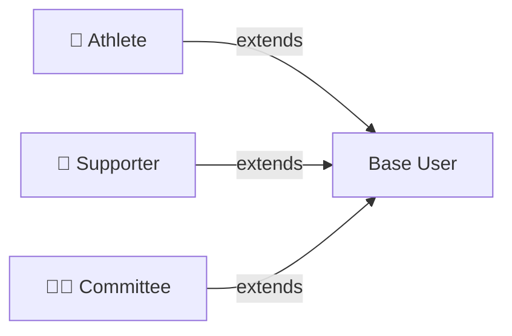
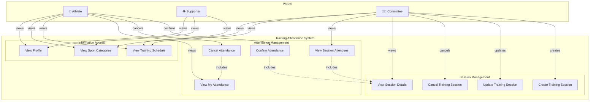
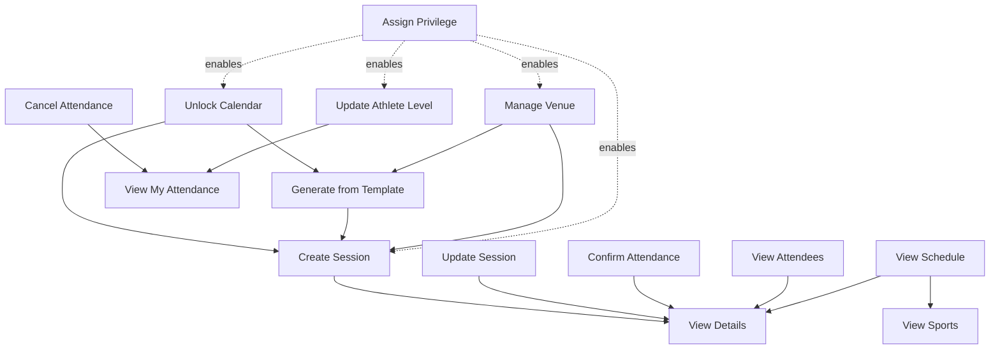

# Use Case Diagrams

This document visualizes the interactions between actors and the system.

## Actor Overview

## Complete Use Case Diagram

---

## Detailed Use Cases

### UC-01: Create Training Session

**Actor:** Committee Member

**Goal:** Schedule a new training session for a sport

**Preconditions:**
- User has Committee profile
- Sport exists in the system

**Main Flow:**
1. Committee member navigates to session management
2. System displays session creation form
3. Committee member selects sport
4. Committee member enters session details:
   - Date and time
   - Location
   - Capacity
   - Optional notes
5. System validates:
   - Date is in the future
   - Capacity is positive
   - All required fields are filled
6. System creates TrainingSession with status "SCHEDULED"
7. System sends notifications to athletes in that sport category
8. System displays success message

**Postconditions:**
- New TrainingSession record created
- Session appears in training schedule
- Athletes notified

**Alternative Flows:**
- **A1: Invalid Date**
  - If date is in the past, system shows error
  - User corrects date and resubmits
- **A2: Invalid Capacity**
  - If capacity ≤ 0, system shows error
  - User corrects capacity and resubmits

**Business Rules:**
- Only Committee members can create sessions
- Session date must be in the future
- Capacity must be greater than 0

---

### UC-02: Update Training Session

**Actor:** Committee Member

**Goal:** Modify details of an existing training session

**Preconditions:**
- User has Committee profile
- TrainingSession exists and is not COMPLETED

**Main Flow:**
1. Committee member views session details
2. Committee member clicks "Edit"
3. System displays editable session details
4. Committee member updates fields (date, location, capacity, notes)
5. System validates changes
6. System updates TrainingSession
7. System notifies affected athletes of changes
8. System displays success message

**Postconditions:**
- TrainingSession record updated
- Athletes notified of changes

**Alternative Flows:**
- **A1: Cannot Reduce Capacity Below Current Attendance**
  - If new capacity < confirmed attendance count
  - System shows error with current attendance count
  - User adjusts capacity or cancels attendances first

**Business Rules:**
- Cannot reduce capacity below current confirmed attendance
- Cannot modify completed sessions
- Date changes require athlete notification

---

### UC-03: Cancel Training Session

**Actor:** Committee Member

**Goal:** Cancel a scheduled training session

**Preconditions:**
- User has Committee profile
- TrainingSession exists and status is SCHEDULED

**Main Flow:**
1. Committee member views session details
2. Committee member clicks "Cancel Session"
3. System prompts for cancellation reason
4. Committee member confirms cancellation
5. System updates session status to CANCELLED
6. System cancels all confirmed attendances
7. System sends cancellation notifications to all attendees
8. System displays success message

**Postconditions:**
- TrainingSession status = CANCELLED
- All Attendance records updated to CANCELLED
- Athletes notified of cancellation

**Business Rules:**
- Cannot cancel completed sessions
- All attendees must be notified
- Cancelled sessions remain in system for historical record

---

### UC-04: View Session Details

**Actor:** All Users

**Goal:** View detailed information about a training session

**Preconditions:**
- TrainingSession exists

**Main Flow:**
1. User selects a training session from schedule
2. System displays session details:
   - Sport name
   - Date and time
   - Location
   - Capacity and available slots
   - Status
   - Notes
   - Committee member who created it
3. If user is Committee: System also shows attendee list
4. If user is Athlete: System shows user's attendance status

**Postconditions:**
- None (read-only operation)

**Variations:**
- **V1: Committee View**
  - Shows full attendee list with contact information
  - Shows attendance statistics
- **V2: Athlete View**
  - Shows their own attendance status
  - Shows available slots count
- **V3: Supporter View**
  - Shows basic session information only

---

### UC-05: Confirm Attendance

**Actor:** Athlete

**Goal:** Confirm attendance for a training session

**Preconditions:**
- User has Athlete profile
- TrainingSession exists and status is SCHEDULED
- Session date is in the future
- Session has available capacity
- User has not already confirmed for this session

**Main Flow:**
1. Athlete views upcoming training sessions
2. Athlete selects a session
3. System displays session details and available slots
4. Athlete clicks "Confirm Attendance"
5. System validates:
   - User is an Athlete
   - Session is not full
   - Session is not cancelled
   - Session is in the future
6. System creates Attendance record with status CONFIRMED
7. System sends confirmation notification to athlete
8. System updates available slots count
9. System displays success message

**Postconditions:**
- Attendance record created with status CONFIRMED
- Session capacity updated
- Athlete receives confirmation

**Alternative Flows:**
- **A1: Session Full**
  - If capacity reached, system shows "Session is full" error
  - System offers option to join waiting list (future feature)
- **A2: Already Confirmed**
  - If user already has confirmed attendance
  - System shows "Already confirmed" message
  - System displays attendance details
- **A3: Session Cancelled**
  - System shows "Session cancelled" error
  - System suggests alternative sessions

**Business Rules:**
- Only Athletes can confirm attendance
- Cannot exceed session capacity
- Cannot confirm for cancelled sessions
- Cannot confirm for past sessions
- One attendance per user per session

---

### UC-06: Cancel Attendance

**Actor:** Athlete

**Goal:** Cancel previously confirmed attendance

**Preconditions:**
- User has Athlete profile
- User has confirmed attendance for the session
- Session status is SCHEDULED

**Main Flow:**
1. Athlete views their confirmed sessions
2. Athlete selects a session to cancel
3. System displays cancellation confirmation dialog
4. Athlete confirms cancellation
5. System updates Attendance status to CANCELLED
6. System records cancelled_at timestamp
7. System frees up capacity slot
8. System sends cancellation confirmation
9. System displays success message

**Postconditions:**
- Attendance status = CANCELLED
- Session capacity slot freed
- Athlete receives cancellation confirmation

**Alternative Flows:**
- **A1: Session Already Started**
  - If session date has passed
  - System shows "Cannot cancel past session" error

**Business Rules:**
- Cannot cancel attendance for sessions that already occurred
- Cancelled slot immediately becomes available for other athletes
- Cancellation is recorded for statistics

---

### UC-07: View My Attendance

**Actor:** Athlete

**Goal:** View list of confirmed and upcoming training sessions

**Preconditions:**
- User has Athlete profile

**Main Flow:**
1. Athlete navigates to "My Attendance"
2. System retrieves user's attendance records
3. System displays categorized lists:
   - **Upcoming Confirmed** (future sessions, confirmed status)
   - **Past Attended** (historical sessions, confirmed status)
   - **Cancelled** (cancelled attendances)
4. For each session, display:
   - Sport name
   - Date and time
   - Location
   - Attendance status
5. Athlete can select a session to view details

**Postconditions:**
- None (read-only operation)

**Variations:**
- **V1: Filter by Sport**
  - Athlete can filter by specific sport
- **V2: Filter by Date Range**
  - Athlete can view attendance history by date range

---

### UC-08: View Session Attendees

**Actor:** Committee Member

**Goal:** View list of athletes who confirmed attendance for a session

**Preconditions:**
- User has Committee profile
- TrainingSession exists

**Main Flow:**
1. Committee member views session details
2. System displays attendee list with:
   - Athlete name
   - Email
   - Confirmation timestamp
   - Any notes
3. System shows attendance statistics:
   - Confirmed count
   - Cancelled count
   - Available slots
   - Capacity utilization percentage
4. Committee member can:
   - Export attendee list
   - Send message to attendees (future feature)

**Postconditions:**
- None (read-only operation)

**Variations:**
- **V1: Export to CSV**
  - Committee member can download attendee list as CSV
- **V2: View Attendance History**
  - Committee member can see historical attendance patterns

**Business Rules:**
- Only Committee members can view full attendee lists
- Athletes can only see their own attendance

---

### UC-09: View Training Schedule

**Actor:** All Users

**Goal:** View upcoming training sessions across all or specific sports

**Preconditions:**
- None

**Main Flow:**
1. User navigates to training schedule
2. System displays upcoming sessions grouped by sport
3. For each session, display:
   - Sport name
   - Date and time
   - Location
   - Available slots
   - Status
4. User can filter by:
   - Sport
   - Date range
   - Location
5. User can select a session to view details

**Postconditions:**
- None (read-only operation)

**Variations:**
- **V1: Athlete View**
  - Shows "Confirm Attendance" button for available sessions
  - Highlights sessions user has confirmed
- **V2: Committee View**
  - Shows "Edit" and "Cancel" buttons for each session
  - Shows detailed attendance statistics
- **V3: Supporter View**
  - Read-only view of schedule
  - No action buttons

**Business Rules:**
- All users can view the schedule
- Only Athletes can interact with sessions (confirm/cancel)
- Only Committee can manage sessions

---

### UC-10: View Sport Categories

**Actor:** All Users

**Goal:** Browse available sports and their information

**Preconditions:**
- None

**Main Flow:**
1. User navigates to sports section
2. System displays list of active sports
3. For each sport, display:
   - Name
   - Description
   - Number of upcoming sessions
   - Number of active athletes
4. User can select a sport to view:
   - Upcoming sessions
   - Sport-specific information

**Postconditions:**
- None (read-only operation)

**Variations:**
- **V1: Committee View**
  - Can see inactive sports
  - Can manage sport information (future feature)

---

### UC-11: View Profile

**Actor:** All Users

**Goal:** View and manage user profile information

**Preconditions:**
- User is authenticated

**Main Flow:**
1. User navigates to profile section
2. System displays user information:
   - Name
   - Email
   - Profile types (Athlete, Supporter, Committee)
   - Account status
3. User can view:
   - Profile details
   - Notification preferences (future feature)

**Postconditions:**
- None (read-only for MVP)

**Future Extensions:**
- Edit profile information
- Change password
- Manage notification preferences
- View activity history

---

### UC-12: Unlock Calendar Period

**Actor:** Committee Member with MANAGE_CALENDAR privilege

**Goal:** Unlock a calendar period for a sport to allow session scheduling

**Preconditions:**
- User has Committee role with MANAGE_CALENDAR privilege
- Sport exists in the system

**Main Flow:**
1. Committee member navigates to calendar management
2. Committee member selects sport
3. System displays current unlocked periods
4. System shows latest unlocked period (if any)
5. Committee member specifies new period (start_date, end_date)
6. System validates:
   - User has MANAGE_CALENDAR privilege
   - Period is sequential (no gaps from latest unlock)
   - Period is within 3 months from today
7. System creates CalendarAccess record
8. System records unlocked_by and unlocked_at (audit trail)
9. System displays success message

**Postconditions:**
- CalendarAccess record created
- Sessions can now be created for dates within unlocked period
- Audit trail recorded

**Alternative Flows:**
- **A1: Non-Sequential Unlock**
  - If period has gap from latest unlock
  - System shows error: "Must unlock sequentially"
  - Shows latest unlock date
- **A2: Beyond 3-Month Limit**
  - If end_date > 3 months from today
  - System shows error: "Cannot unlock beyond 3 months ahead"

**Business Rules:**
- Only Committee with MANAGE_CALENDAR privilege can unlock
- Must be sequential (no gaps)
- Maximum 3 months ahead
- Per-sport locking
- Immutable audit trail

---

### UC-13: Create Session from Template

**Actor:** Committee Member with MANAGE_SESSIONS privilege

**Goal:** Generate training sessions from existing template for unlocked period

**Preconditions:**
- User has Committee role with MANAGE_SESSIONS privilege
- SessionTemplate exists and is active
- Calendar is unlocked for target period

**Main Flow:**
1. Committee member selects unlocked calendar period
2. System displays active templates for sport
3. Committee member selects template(s)
4. Committee member specifies date range within unlocked period
5. System validates:
   - User has MANAGE_SESSIONS privilege
   - Template is active
   - Date range is within unlocked calendar
6. System generates TrainingSession for each matching day of week
7. System copies template properties (venue, time, targetLevel, capacity)
8. System displays generated sessions for review
9. Committee member confirms generation
10. System creates all TrainingSession records

**Postconditions:**
- Individual TrainingSession records created
- Sessions can be independently edited/cancelled
- Calendar populated for period

**Alternative Flows:**
- **A1: Partial Unlock**
  - If date range extends beyond unlocked calendar
  - System only generates for unlocked dates
  - Shows warning about skipped dates
- **A2: Duplicate Sessions**
  - If session already exists for same day/time/venue
  - System skips duplicate
  - Shows warning about existing sessions

**Business Rules:**
- Generated sessions are independent (not live-linked to template)
- Critical for MVP - enables quick weekly schedule population
- Can edit/cancel individual generated sessions

---

### UC-14: Manage Venue

**Actor:** Committee Member with MANAGE_VENUES privilege

**Goal:** Create or update venue with sport tags

**Preconditions:**
- User has Committee role with MANAGE_VENUES privilege

**Main Flow (Create):**
1. Committee member navigates to venue management
2. Committee member clicks "Create Venue"
3. Committee member enters venue details:
   - Name
   - Address
   - Capacity (informational)
   - Sport tags (select from active sports)
4. System validates:
   - User has MANAGE_VENUES privilege
   - Venue name is unique
   - At least one sport tag selected
5. System creates Venue record
6. System displays success message

**Main Flow (Update):**
1. Committee member views existing venue
2. Committee member clicks "Edit"
3. Committee member modifies fields
4. System validates changes
5. System updates Venue record
6. System displays success message

**Postconditions:**
- Venue available for session creation
- Venue appears in dropdowns filtered by sport tag

**Alternative Flows:**
- **A1: Duplicate Venue Name**
  - System shows error: "Venue name already exists"
  - User modifies name

**Business Rules:**
- Only Committee with MANAGE_VENUES privilege can create/edit
- Venue capacity is informational only
- Sport tags enable filtering when creating sessions
- Provides consistent location data

---

### UC-15: Assign Committee Privilege

**Actor:** Committee Admin (Committee member with all 5 privileges)

**Goal:** Assign specific privilege to Committee member

**Preconditions:**
- User has Committee role with all 5 privileges (COMMITTEE_ADMIN)
- Target user has Committee role

**Main Flow:**
1. Committee Admin navigates to privilege management
2. System displays all Committee members
3. Committee Admin selects target user
4. System displays current privileges for target user
5. Committee Admin selects privilege to assign:
   - MANAGE_SESSIONS
   - MANAGE_CALENDAR
   - MANAGE_ATHLETES
   - MANAGE_VENUES
   - VIEW_ANALYTICS
6. System validates:
   - Admin has all 5 privileges (COMMITTEE_ADMIN)
   - Target user has COMMITTEE role
   - Privilege not already assigned
7. System updates UserRole privileges list
8. System records assigned_by and assigned_at
9. System displays success message

**Postconditions:**
- Target user gains specific privilege
- Audit trail recorded
- User can now perform privilege-specific actions

**Alternative Flows:**
- **A1: Not Committee Admin**
  - If admin missing any privilege
  - System shows error: "Only COMMITTEE_ADMIN can assign privileges"
- **A2: Already Has Privilege**
  - System shows info: "User already has this privilege"

**Business Rules:**
- Only COMMITTEE_ADMIN can assign privileges
- System must always have at least one COMMITTEE_ADMIN
- Cannot revoke all privileges from last COMMITTEE_ADMIN
- Audit trail for all privilege changes

---

### UC-16: Update Athlete Level

**Actor:** Committee Member with MANAGE_ATHLETES privilege

**Goal:** Update athlete's skill level with audit trail

**Preconditions:**
- User has Committee role with MANAGE_ATHLETES privilege
- Target user has ATHLETE role and AthleteProfile

**Main Flow:**
1. Committee member views athlete list
2. Committee member selects athlete
3. System displays current level and history
4. Committee member selects new level:
   - BEGINNER
   - INTERMEDIATE
   - ADVANCED
5. Committee member enters optional reason for change
6. System validates:
   - User has MANAGE_ATHLETES privilege
   - New level is different from current
7. System updates AthleteProfile.level
8. System creates AthleteProfileHistory record:
   - old_level = current level
   - new_level = selected level
   - changed_by = Committee member
   - changed_at = timestamp
   - reason = optional explanation
9. System displays success message

**Postconditions:**
- AthleteProfile updated with new level
- AthleteProfileHistory record created (immutable audit trail)
- Level change tracked

**Alternative Flows:**
- **A1: Same Level**
  - If new level equals current level
  - System shows info: "Level unchanged"
- **A2: No Athlete Profile**
  - If user doesn't have ATHLETE role
  - System shows error: "User is not an athlete"

**Business Rules:**
- Only Committee with MANAGE_ATHLETES privilege can modify
- Level is informational - doesn't restrict session attendance
- History is immutable (cannot be deleted)
- First history record has null old_level
- MVP: Data captured, UI viewing is future feature

---

## Actor Permissions Matrix

### Basic Permissions

| Use Case | Athlete | Supporter | Committee (Base) |
|----------|---------|-----------|------------------|
| View Session Details | ✅ | ✅ | ✅ |
| View Training Schedule | ✅ | ✅ | ✅ |
| View Sport Categories | ✅ | ✅ | ✅ |
| View Profile | ✅ | ✅ | ✅ |

### Athlete-Specific Permissions

| Use Case | Athlete | Supporter | Committee |
|----------|---------|-----------|-----------|
| Confirm Attendance | ✅ | ❌ | ✅* (if also Athlete) |
| Cancel Attendance | ✅ | ❌ | ✅* (if also Athlete) |
| View My Attendance | ✅ | ❌ | ✅* (if also Athlete) |

*Note: Committee members can also have ATHLETE role*

### Committee Privilege-Based Permissions

| Use Case | Required Privilege |
|----------|-------------------|
| Create Training Session (UC-01) | MANAGE_SESSIONS |
| Update Training Session (UC-02) | MANAGE_SESSIONS |
| Cancel Training Session (UC-03) | MANAGE_SESSIONS |
| View Session Attendees (UC-08) | Any Committee privilege |
| Unlock Calendar Period (UC-12) | MANAGE_CALENDAR |
| Create Session from Template (UC-13) | MANAGE_SESSIONS |
| Manage Venue (UC-14) | MANAGE_VENUES |
| Assign Committee Privilege (UC-15) | All 5 privileges (COMMITTEE_ADMIN) |
| Update Athlete Level (UC-16) | MANAGE_ATHLETES |

### Committee Privileges Breakdown

**The 5 Committee Privileges:**
1. **MANAGE_SESSIONS**: Create, update, cancel training sessions
2. **MANAGE_CALENDAR**: Unlock/lock scheduling periods
3. **MANAGE_ATHLETES**: Edit athlete levels, manage profiles
4. **MANAGE_VENUES**: Add and edit venue information
5. **VIEW_ANALYTICS**: Access reports and statistics (future feature)

**COMMITTEE_ADMIN** = Committee member with all 5 privileges (can assign privileges to others)

---

## Use Case Dependencies

---

## Next Steps

See also:
- [Class Diagram](./class-diagram.md) - Entity structure
- [ER Diagram](./er-diagram.md) - Database design
- [Domain README](./README.md) - Complete domain overview
