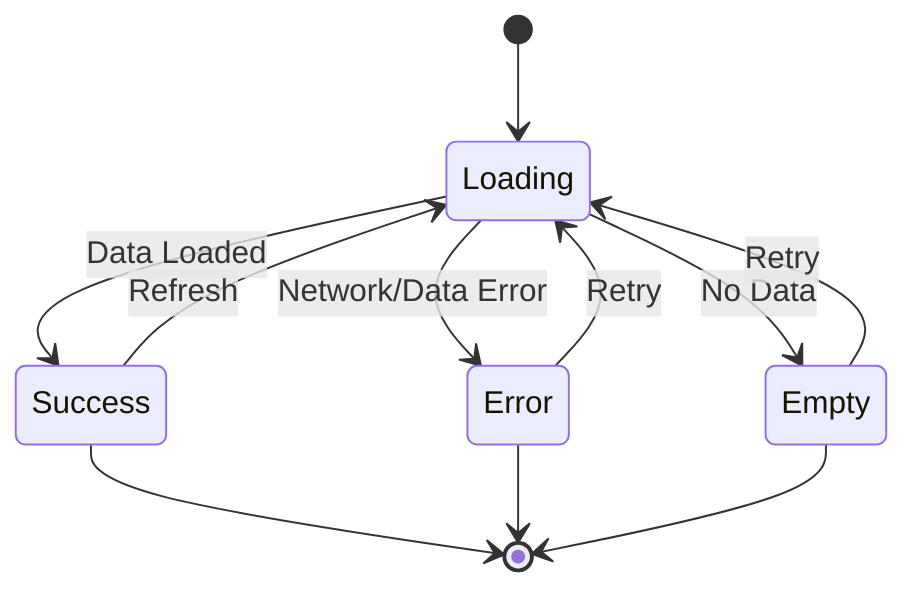

# Screen States

## Loading States Pattern

This diagram shows the common loading state pattern used across all screens in the application.

## State Descriptions

### Loading
- Initial state when data is being fetched
- Show loading indicator/skeleton screens
- Disable user interactions during load

### Success
- Data successfully loaded and displayed
- User can interact with content
- Refresh action returns to Loading state

### Error
- Network error or data fetch failure
- Display error message with retry option
- Retry action returns to Loading state

### Empty
- No data available (e.g., no training sessions scheduled)
- Display empty state message
- Provide action to add data or retry
