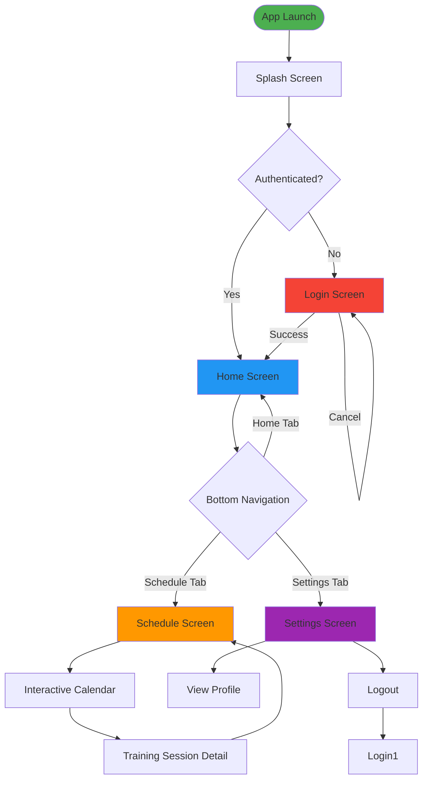
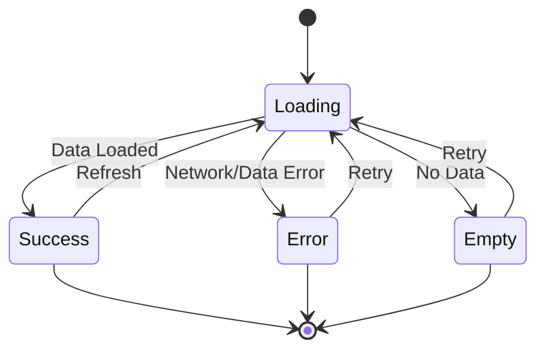
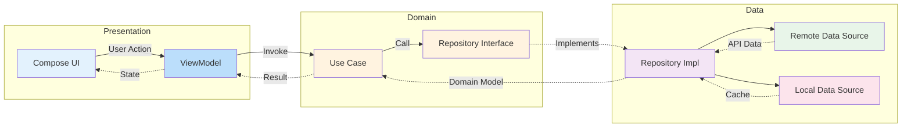
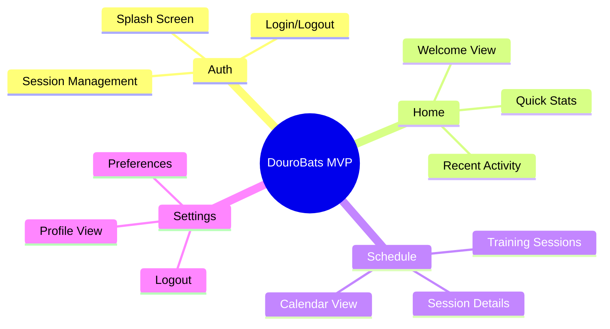

# DouroBats UI Flow

## User Navigation Flow

```mermaid
flowchart TD
    Start([App Launch]) --> Splash[Splash Screen]

    Splash --> AuthCheck{Authenticated?}

    AuthCheck -->|No| Login[Login Screen]
    AuthCheck -->|Yes| Home[Home Screen]

    Login -->|Success| Home
    Login -->|Cancel| Login

    Home --> NavBar{Bottom Navigation}

    NavBar -->|Home Tab| Home
    NavBar -->|Schedule Tab| Schedule[Schedule Screen]
    NavBar -->|Settings Tab| Settings[Settings Screen]

    Schedule --> Calendar[Interactive Calendar]
    Calendar --> SessionDetail[Training Session Detail]
    SessionDetail --> Schedule

    Settings --> Profile[View Profile]
    Settings --> Logout[Logout]

    Logout --> Login1

    style Start fill:#4caf50
    style Home fill:#2196f3
    style Schedule fill:#ff9800
    style Settings fill:#9c27b0
    style Login fill:#f44336
```

## Screen States

```mermaid
stateDiagram-v2
    [*] --> Loading

    Loading --> Success: Data Loaded
    Loading --> Error: Network/Data Error
    Loading --> Empty: No Data

    Success --> Loading: Refresh
    Error --> Loading: Retry
    Empty --> Loading: Retry

    Success --> [*]
    Error --> [*]
    Empty --> [*]
```

## Data Flow (Clean Architecture)

```mermaid
flowchart LR
    subgraph Presentation
        UI[Compose UI]
        VM[ViewModel]
    end

    subgraph Domain
        UC[Use Case]
        Repo[Repository Interface]
    end

    subgraph Data
        RepoImpl[Repository Impl]
        Remote[Remote Data Source]
        Local[Local Data Source]
    end

    UI -->|User Action| VM
    VM -->|Invoke| UC
    UC -->|Call| Repo
    Repo -.->|Implements| RepoImpl
    RepoImpl --> Remote
    RepoImpl --> Local

    Local -.->|Cache| RepoImpl
    Remote -.->|API Data| RepoImpl
    RepoImpl -.->|Domain Model| UC
    UC -.->|Result| VM
    VM -.->|State| UI

    style UI fill:#e3f2fd
    style VM fill:#bbdefb
    style UC fill:#fff3e0
    style Repo fill:#fff3e0
    style RepoImpl fill:#f3e5f5
    style Remote fill:#e8f5e9
    style Local fill:#fce4ec
```

## MVP Feature Set

```mermaid
mindmap
    root((DouroBats MVP))
        Auth
            Splash Screen
            Login/Logout
            Session Management
        Home
            Welcome View
            Quick Stats
            Recent Activity
        Schedule
            Calendar View
            Training Sessions
            Session Details
        Settings
            Profile View
            Preferences
            Logout
```
