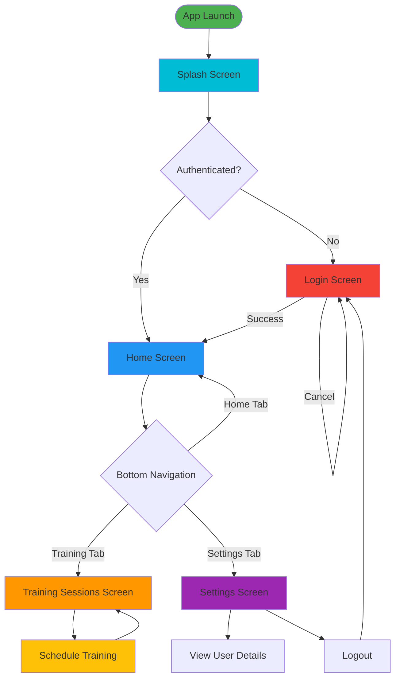

# DouroBats User Flow

## Application Navigation Flow

This diagram shows the complete user journey from app launch through authentication and main navigation.

## Key Navigation Points

### Entry Flow
1. User opens app
2. Splash screen displays
3. Authentication check:
   - **Authenticated** → Navigate to Home Screen
   - **Not Authenticated** → Navigate to Login Screen

### Main Navigation (Bottom Navigation Bar)
- **Home Screen**: Main dashboard
- **Training Sessions Screen**: View and manage training sessions
  - Can schedule new training from here
- **Settings Screen**: User profile and preferences
  - View user details
  - Logout option

### Authentication Flow
- Login required for first-time users or after logout
- Successful login redirects to Home Screen
- Logout returns user to Login Screen
